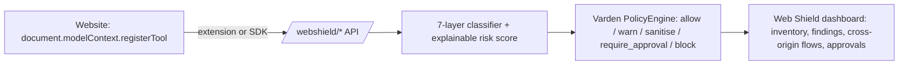

# Varden


[](https://github.com/markndg/varden/releases)
[](https://github.com/markndg/varden/actions)
[](https://github.com/markndg/varden/releases)
[](https://github.com/markndg/varden)

> Using Varden? Drop a note — I read everything: [open a blank issue titled "Using this"](https://github.com/markndg/varden/issues/new)

**Project links:** [Source](https://github.com/markndg/varden) · [Issues](https://github.com/markndg/varden/issues) · [Security](https://github.com/markndg/varden/security)


Your developers are using Cursor. It's calling APIs, running git commands,
talking to external services, executing shell commands.

Do you know what it's doing?

Now multiply that by a team of ten, all running AI agents with MCP access to your
infrastructure. 
Nobody has a complete inventory of what those agents can touch.
Nobody sees it when one does something unexpected.
Nobody knows when a new capability quietly appears.

A runtime governance layer for AI agents, tools and MCP servers.

**Varden observes, governs, and audits agent activity in real time.**

**Varden is the thing watching.**

---

## Try it now

```bash
pip install varden
varden demo
```

That's it. Varden starts, bootstraps a baseline policy, runs demo agents, and opens the dashboard showing blocked, warned, and monitored actions.

**Or clone and run from source:**
```bash
git clone https://github.com/markndg/varden
cd varden
python -m venv .venv && source .venv/bin/activate
pip install -e .
varden demo
```

**Wrap your CLI tools with Varden session:**
```bash
export VARDEN_BASE_URL=http://127.0.0.1:8000
export VARDEN_API_KEY=admin-demo-key
varden session . -- cursor .
```

Subprocess calls, HTTP requests, and LLM calls that Cursor makes now appear in your
dashboard — blocked, warned, or logged according to your policy.

> **Note:** Varden intercepts via a PATH shim. Child processes Cursor spawns will
> be covered; processes Cursor launches outside the shell PATH may not be. Use an
> interactive `varden session` shell for broadest coverage.


---

## One line protects your Python agents

```python
import varden
import requests

varden.protect()

# Everything below is now intercepted, checked against policy, and logged.
# Nothing changes in your code. Everything changes in your visibility.
requests.post("https://partner.example/api", json={"token": "abc123"})
```

Varden patches the Python runtime — `requests`, `httpx`, `subprocess`, OpenAI, Anthropic
— so every action is checked before it runs. Your developers add one line. You get a
dashboard full of traces.

---

## What Varden covers

| Action type | What gets checked |
|-------------|-------------------|
| Tool calls | MCP tool calls, before execution |
| HTTP/API requests | Outbound calls, including payload classification |
| Subprocess execution | Shell commands, before they run |
| LLM calls | Provider calls to OpenAI, Anthropic, others |
| CLI tools | kubectl, terraform, aws, gcloud, git, docker, cursor — via `varden session` |

Decisions are **allow**, **warn**, **block**, or **monitor**. Every decision lands in the
dashboard with classifiers, risk scores, and a full trace.

---

## Browser agents now have a tool supply chain

Websites can now dynamically expose tools to browser agents via WebMCP
(`document.modelContext.registerTool`). That means **tool metadata and tool
output are untrusted input** — a page can register a tool whose description
tells an agent to ignore its instructions, call an unrelated wallet tool, or
exfiltrate data to another origin, and the agent may never know the
difference.

**Varden Web Shield** detects, governs and audits that surface with the same
runtime-governance model Varden already uses for tool calls, HTTP requests
and LLM calls: a layered classifier scans every registration and output for
prompt injection, Unicode obfuscation, capability mismatch and cross-origin
data flow; an explainable 0–100 risk score feeds the same policy engine
(`allow` / `warn` / `sanitise` / `require_approval` / `block`); and every
decision — plus whether it was actually enforceable in the browser — shows
up in the dashboard.

```bash
pip install varden
varden web-shield demo
```

The demo starts Varden, seeds a Web Shield dashboard, and opens a
self-contained attack lab with 20 safe, simulated cases (prompt injection,
Base64-obfuscated instructions, capability mismatch, cross-origin flows,
lifecycle manipulation, and more) — no browser extension or external
accounts required to see detection happen.



Also included: a Chromium MV3 browser extension with an offline-safe local
fallback scanner, a framework-neutral `@varden/web-shield` JS SDK for
first-party integrations, and a `varden web-shield evaluate` command that
reports real precision/recall/latency against a versioned test corpus (not
just claimed effectiveness). Full docs start at
[`docs/web-shield.md`](docs/web-shield.md); an honest list of what it
doesn't do is in [`docs/web-shield-limitations.md`](docs/web-shield-limitations.md).

---

## Rule impact intelligence

Know which rules are working, which are over-firing, and where your coverage gaps are.


Every rule shows its detection count, coverage percentage, false positive proxy, and 
which agents and tools it's touching. The drilldown panel shows the most recent 
decision for any rule in one click.

---

## Why self-hosted matters

Most AI security products inspect prompts in the cloud. Your data leaves your
infrastructure to be evaluated by someone else's service.

Varden runs on your infrastructure. Your policy file, your data, your control plane.
No traffic leaves unless you decide it does.


---

## Quickstart

### 1. Install

```bash
git clone https://github.com/markndg/varden
cd varden
python -m venv .venv && source .venv/bin/activate
pip install -e .
```

### 2. Create a policy

```bash
python -c "import json, pathlib; p=pathlib.Path('policy-packs/baseline-operational-safety.json'); pathlib.Path('policy.json').write_text(json.dumps(json.loads(p.read_text(encoding='utf-8'))['template'], indent=2) + '\n', encoding='utf-8')"
```

### 3. Start Varden

```bash
python -m varden.api --config examples/dev.env
```

### 4. Open the dashboard

- Dashboard: `http://127.0.0.1:8000/`
- Rules editor: `http://127.0.0.1:8000/ui/rules`
- API docs: `http://127.0.0.1:8000/docs`
- Bootstrap key: `admin-demo-key`

### 5. Run the demo

```bash
python -m varden.cli demo
```

Shows a blocked action, a warned action, and a clean allowed action — all visible in the
dashboard immediately.

---

## Policy model

Policies are a JSON file with four outcome lists (`block`, `warn`, `monitor`, `allow`) plus optional `budget_rules` for LLM spend caps.

```json
{
  "block": [
    {"type": "tool_call", "tool": "delete_database"},
    {"type": "tool_call", "tool": "subprocess.run", "field:args.args": {"contains": "delete_database"}}
  ],
  "warn": [
    {"classifier:secrets": true},
    {"classifier:internal": true}
  ],
  "monitor": [],
  "allow": [],
  "budget_rules": [
    {
      "id": "session-default-cap",
      "type": "token_budget",
      "limit_usd": 10.0,
      "window": "session",
      "hard_cap": true
    }
  ]
}
```

Rules are evaluated in order: `block → warn → monitor → allow`. First match wins.
Token budget rules run on `llm_call` actions before execution (pre-check) and after completion via SDK usage logging (post-record).
Edit visually at `/ui/rules` or directly in the JSON file. Policy versions are tracked.

---

## Token budgets (LLM cost governance)

Cap LLM spend per trace (`session`), workflow (`daily` / `monthly`), or both. Budget rules live in the top-level `budget_rules` array.

- **Pre-check** (`POST /sdk/guard`): projects cost from model + token limits and blocks or warns before the call runs.
- **Post-record** (`POST /sdk/log`): increments spend from provider `usage` metadata forwarded by the SDK.
- **CLI**: `varden budget status` lists active budget rows from SQLite.

Import the `llm-cost-governance` policy pack for ready-made budget rules, or add your own `budget_rules` entries.

**Dashboard:** Rules workspace → **budget** tab (full editor). Overview → **Token budgets** panel (live spend). Rule impact → **budget** bucket.

**Demo** (with Varden running on `:8000`):

```bash
python demos/token_budget_agent.py
```

---

## Policy pack import

Repository policy packs live in `policy-packs/`. Import them from the dashboard (**Rules → Templates → Import & save**) or via API:

```bash
curl -X POST http://127.0.0.1:8000/policy/import-pack \
  -H "x-api-key: admin-demo-key" \
  -H "content-type: application/json" \
  -d '{"pack_id":"baseline-operational-safety","mode":"merge"}'
```

- `GET /policy/packs` — list available packs
- `GET /policy/packs/{pack_id}` — fetch a pack document
- `POST /policy/import-pack` — merge or replace into the active policy file

---

## MCP tool inventory

Discover MCP servers registered in Cursor config files and compare tools against your policy coverage gaps.

- **Dashboard**: Overview page → enter an MCP config path (e.g. `~/.cursor/mcp.json`) → **Scan path**, or leave blank and use **Scan defaults**
- `GET /mcp/inventory` — current indexed servers, tools, and uncovered tools
- `POST /mcp/scan` — scan MCP configs; body may include `path` (string) or `paths` (array). Omit both to scan defaults (`~/.cursor/mcp.json`, project `.cursor/mcp.json`, and `VARDEN_MCP_CONFIG_PATHS`)

---

## LangChain integration

```python
import varden
from varden_langchain import protect_tools

varden.protect_from_env(auto_instrument=False)
tools = protect_tools(tools, agent_name='support-agent')
```

Pre-execution allow / warn / block on every tool call, with full trace visibility in the
dashboard. Drop-in — no changes to your agent architecture.

**Demos:**

```bash
python demos/langchain/allow_warn_block_demo.py
python demos/langchain/sql_guard_demo.py
python demos/langchain/exfiltration_demo.py
```

## `varden session`: wrap any CLI tool

The session command starts a shell with a PATH prefix so selected binaries route through
Varden before running. Use it to watch — and enforce policy on — any tool your team or
their agents call.

```bash
# Watch what Cursor does in the current directory
varden session . -- cursor .

# One-shot: guard a single kubectl command
varden session -- kubectl delete pod my-pod

# Passive mode: log without blocking
varden session --passive
```

**Shimmed by default:** cursor, kubectl, terraform, aws, gcloud, az, docker,
docker-compose, git, npm, pip, pip3, railway, supabase, vercel, fly, render, psql, mysql.

---

## Self-hosting

```bash
docker compose -f deploy/docker-compose.yml up
```

See `deploy/self_hosting.md` and `deploy/operations.md` for production configuration.
Local defaults use SQLite. Production self-hosting should use a strong signing secret
and disable the dev bootstrap auth.

---

## Licence

Licensed under the Apache License 2.0. See LICENSE.

