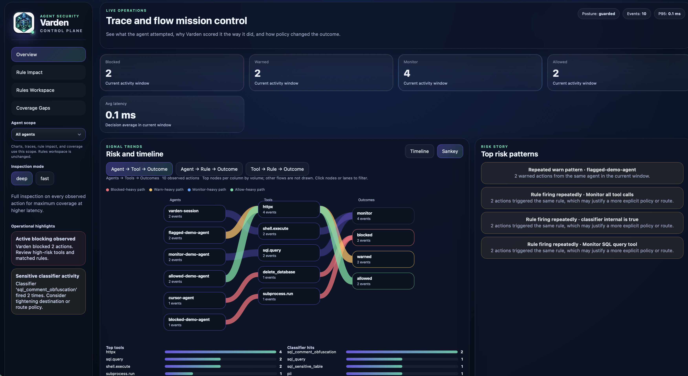
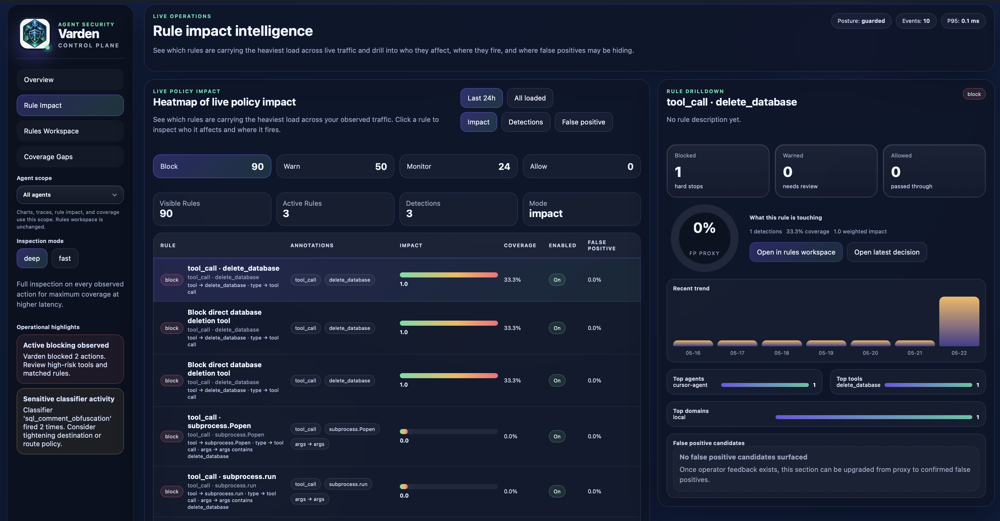
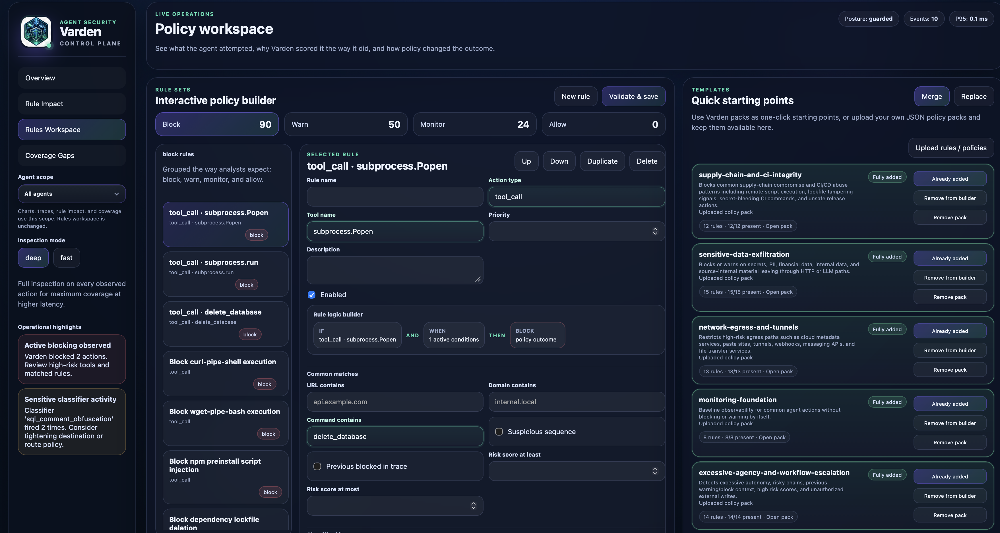

# Varden


[](https://github.com/markndg/varden/blob/main/LICENSE) [](https://github.com/markndg/varden/releases) [](https://github.com/markndg/varden/actions) [](https://github.com/markndg/varden) [](https://www.python.org) [](https://github.com/markndg/varden/blob/main/COMMERCIAL.md)

> Using Varden? I read everything — [open a blank issue titled "Using this"](https://github.com/markndg/varden/issues/new)
Your developers are using Cursor. It's calling APIs, running git commands,
talking to external services, executing shell commands.

Do you know what it's doing?

Now multiply that by a team of ten, all running AI agents with MCP access to your
infrastructure. Nobody has a list of what those agents can touch. Nobody sees it when
one does something unexpected.

**Varden is the thing watching.**

---

## Try it now

```bash
pip install varden
varden demo
```

That's it. Varden starts, bootstraps a baseline policy, runs demo agents, and opens the dashboard showing blocked, warned, and monitored actions.

**Or clone and run from source:**
```bash
git clone https://github.com/markndg/varden
cd varden
python -m venv .venv && source .venv/bin/activate
pip install -e .
varden demo
```

**Wrap your CLI tools with Varden session:**
```bash
export VARDEN_BASE_URL=http://127.0.0.1:8000
export VARDEN_API_KEY=admin-demo-key
varden session . -- cursor .
```

Subprocess calls, HTTP requests, and LLM calls that Cursor makes now appear in your
dashboard — blocked, warned, or logged according to your policy.

> **Note:** Varden intercepts via a PATH shim. Child processes Cursor spawns will
> be covered; processes Cursor launches outside the shell PATH may not be. Use an
> interactive `varden session` shell for broadest coverage.



---

## One line protects your Python agents

```python
import varden
import requests

varden.protect()

# Everything below is now intercepted, checked against policy, and logged.
# Nothing changes in your code. Everything changes in your visibility.
requests.post("https://partner.example/api", json={"token": "abc123"})
```

Varden patches the Python runtime — `requests`, `httpx`, `subprocess`, OpenAI, Anthropic
— so every action is checked before it runs. Your developers add one line. You get a
dashboard full of traces.

---

## What Varden covers

| Action type | What gets checked |
|-------------|-------------------|
| Tool calls | MCP tool calls, before execution |
| HTTP/API requests | Outbound calls, including payload classification |
| Subprocess execution | Shell commands, before they run |
| LLM calls | Provider calls to OpenAI, Anthropic, others |
| CLI tools | kubectl, terraform, aws, gcloud, git, docker, cursor — via `varden session` |

Decisions are **allow**, **warn**, **block**, or **monitor**. Every decision lands in the
dashboard with classifiers, risk scores, and a full trace.

---

## Rule impact intelligence

Know which rules are working, which are over-firing, and where your coverage gaps are.



Every rule shows its detection count, coverage percentage, false positive proxy, and 
which agents and tools it's touching. The drilldown panel shows the most recent 
decision for any rule in one click.

---

## Why self-hosted matters

Most AI security products inspect prompts in the cloud. Your data leaves your
infrastructure to be evaluated by someone else's service.

Varden runs on your infrastructure. Your policy file, your data, your control plane.
No traffic leaves unless you decide it does.



---

## Quickstart

### 1. Install

```bash
git clone https://github.com/markndg/varden
cd varden
python -m venv .venv && source .venv/bin/activate
pip install -e .
```

### 2. Create a policy

```bash
python -c "import json, pathlib; p=pathlib.Path('policy-packs/baseline-operational-safety.json'); pathlib.Path('policy.json').write_text(json.dumps(json.loads(p.read_text(encoding='utf-8'))['template'], indent=2) + '\n', encoding='utf-8')"
```

### 3. Start Varden

```bash
python -m varden.api --config examples/dev.env
```

### 4. Open the dashboard

- Dashboard: `http://127.0.0.1:8000/`
- Rules editor: `http://127.0.0.1:8000/ui/rules`
- API docs: `http://127.0.0.1:8000/docs`
- Bootstrap key: `admin-demo-key`

### 5. Run the demo

```bash
python -m varden.cli demo
```

Shows a blocked action, a warned action, and a clean allowed action — all visible in the
dashboard immediately.

---

## Policy model

Policies are a JSON file with four lists: `block`, `warn`, `monitor`, `allow`.

```json
{
  "block": [
    {"type": "tool_call", "tool": "delete_database"},
    {"type": "tool_call", "tool": "subprocess.run", "field:args.args": {"contains": "delete_database"}}
  ],
  "warn": [
    {"classifier:secrets": true},
    {"classifier:internal": true}
  ],
  "monitor": [],
  "allow": []
}
```

Rules are evaluated in order: `block → warn → monitor → allow`. First match wins.
Edit visually at `/ui/rules` or directly in the JSON file. Policy versions are tracked.

---

## LangChain integration

```python
import varden
from varden_langchain import protect_tools

varden.protect_from_env(auto_instrument=False)
tools = protect_tools(tools, agent_name='support-agent')
```

Pre-execution allow / warn / block on every tool call, with full trace visibility in the
dashboard. Drop-in — no changes to your agent architecture.

**Demos:**

```bash
python demos/langchain/allow_warn_block_demo.py
python demos/langchain/sql_guard_demo.py
python demos/langchain/exfiltration_demo.py
```

## `varden session`: wrap any CLI tool

The session command starts a shell with a PATH prefix so selected binaries route through
Varden before running. Use it to watch — and enforce policy on — any tool your team or
their agents call.

```bash
# Watch what Cursor does in the current directory
varden session . -- cursor .

# One-shot: guard a single kubectl command
varden session -- kubectl delete pod my-pod

# Passive mode: log without blocking
varden session --passive
```

**Shimmed by default:** cursor, kubectl, terraform, aws, gcloud, az, docker,
docker-compose, git, npm, pip, pip3, railway, supabase, vercel, fly, render, psql, mysql.

---

## Self-hosting

```bash
docker compose -f deploy/docker-compose.yml up
```

See `deploy/self_hosting.md` and `deploy/operations.md` for production configuration.
Local defaults use SQLite. Production self-hosting should use a strong signing secret
and disable the dev bootstrap auth.

---

## Licence

**Core platform and dashboard:** AGPL-3.0
**SDKs** (`sdks/python`, `sdks/java`, `sdks/rust`): Apache-2.0

Commercial licence available for teams that cannot accept AGPL obligations —
see [COMMERCIAL.md](COMMERCIAL.md).