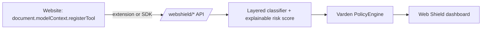
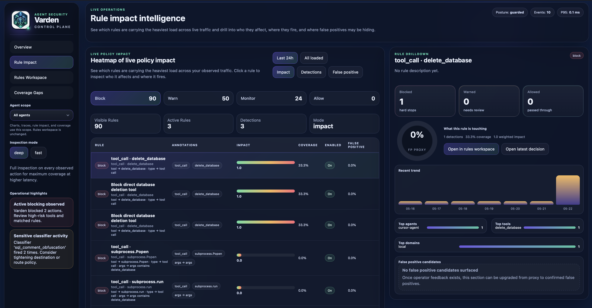
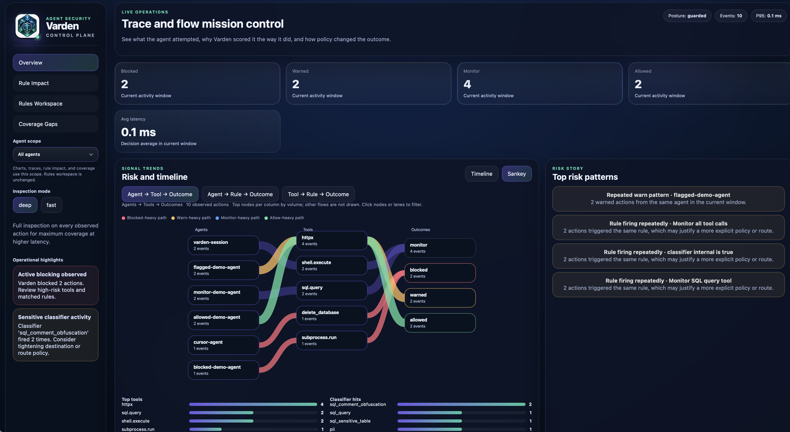
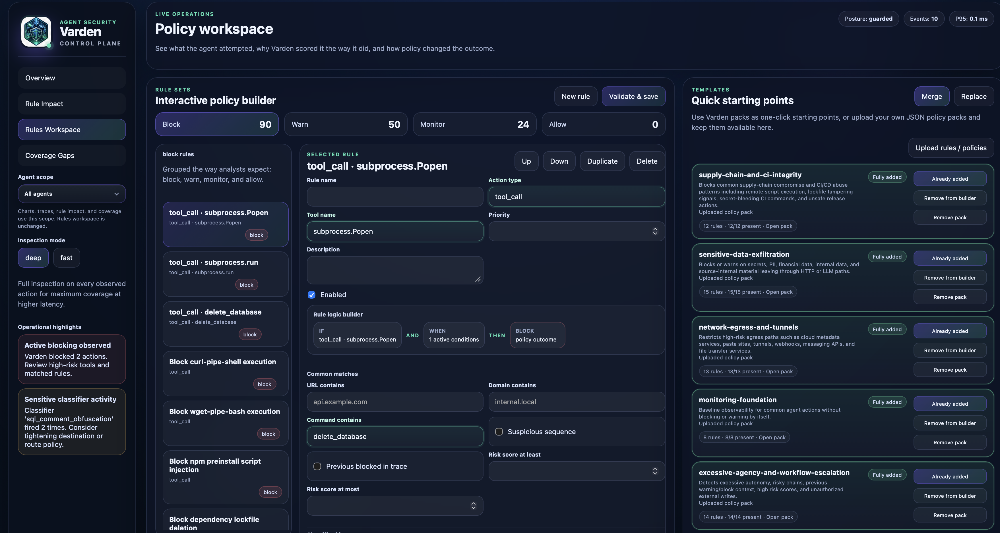

# Varden


[](https://github.com/markndg/varden/releases)
[](https://github.com/markndg/varden/actions)
[](https://github.com/markndg/varden/releases)
[](https://github.com/markndg/varden)

> Using Varden? Drop a note — I read everything: [open a blank issue titled "Using this"](https://github.com/markndg/varden/issues/new)

**Project links:** [Source](https://github.com/markndg/varden) · [Issues](https://github.com/markndg/varden/issues) · [Security](https://github.com/markndg/varden/security)

---

## Runtime security for AI agents

AI agents don't just generate text.

They call APIs. Run shell commands. Read and write files. Use MCP servers. Invoke tools. Talk to external systems. Consume untrusted content. Carry credentials and authority that the content influencing them does not have.

The security question is no longer just:

> **Is this individual action allowed?**

It is also:

> **What caused this action? What authority is being exercised? What becomes reachable if we allow it?**

**Varden is a self-hosted runtime security and governance layer for AI agents.**

It intercepts supported agent actions before execution, applies policy across tools, HTTP, files, subprocesses, MCP and browser interactions, tracks the provenance and authority behind those actions, and can determine which hazardous capabilities become reachable **before the agent exercises them**.

Varden is not a prompt classifier and does not ask an LLM whether another agent looks safe.

It produces deterministic policy decisions, runtime enforcement and evidence of what was actually protected.

```text
                    Agent action
                         │
                         ▼
                ┌─────────────────┐
                │ Runtime boundary│
                └────────┬────────┘
                         │
          ┌──────────────┼──────────────┐
          │              │              │
          ▼              ▼              ▼
       Policy       Provenance      Authority
          │              │              │
          └──────────────┼──────────────┘
                         │
                         ▼
                Predictive Authority
                         │
                         ▼
             ┌───────────────────────┐
             │ allow                 │
             │ warn                  │
             │ require approval      │
             │ sanitise              │
             │ block                 │
             └───────────┬───────────┘
                         │
                         ▼
                 Verifiable evidence
```

### Enforce

Supported privileged side effects pass through a shared pre-execution security boundary before they happen.

### Prove

Coverage, readiness and posture report what Varden is actually enforcing — including gaps.

### Understand authority

Varden tracks provenance so that untrusted information cannot silently borrow the privileges of the agent consuming it.

### Look ahead

Predictive Authority performs deterministic reachability analysis to identify dangerous authority states that become reachable if an action is permitted.

### Watch external intelligence

Threat Intelligence, off unless `VARDEN_TI_ENABLED=true`, watches configured external sources and turns structured records into security contracts. A contract is not a rule. A candidate rule does nothing until a person approves it through Varden's normal policy file. External text is untrusted data. See [docs/threat-intelligence.md](docs/threat-intelligence.md).

**Varden observes, governs, predicts and audits agent activity at runtime.**

**Varden is the thing watching.**

---

## Try it now

```bash
pip install varden
varden demo
```

That's it.

Varden starts, bootstraps a baseline policy, runs demo agents and opens the dashboard showing blocked, warned and monitored actions.

Or clone and run from source:

```bash
git clone https://github.com/markndg/varden
cd varden

python -m venv .venv
source .venv/bin/activate

pip install -e .
varden demo
```

---

## One line protects your Python agents

```python
import varden
import requests

varden.protect()

# Everything below is now intercepted, checked against policy and logged.
requests.post(
    "https://partner.example/api",
    json={"token": "abc123"},
)
```

`varden.protect()` establishes an enforced runtime boundary around supported surfaces with `mode=guarded` and fail-closed control-plane semantics by default.

For stricter coverage requirements:

```python
varden.protect(
    mode="strict",
    require_coverage=["http", "subprocess", "mcp"],
)
```

Varden instruments supported Python runtime surfaces including HTTP clients, subprocess execution, filesystem APIs and provider transports.

MCP configurations can be routed through the Varden MCP gateway.

Your application keeps running normally.

Varden gets the opportunity to make a security decision **before supported side effects occur**.

---

# The Varden security model

## 1. Enforce before execution

Varden's runtime boundary is designed around a simple rule:

> **A security decision is most useful before the side effect happens.**

Supported privileged actions are routed through the shared guard:

```text
Agent
  │
  ▼
Action
  │
  ▼
Varden guard
  │
  ├── policy
  ├── classifiers
  ├── provenance
  ├── authority
  └── predictive authority
  │
  ▼
Decision
  │
  ├── allow ───────────────► execute
  ├── monitor ─────────────► execute + record
  ├── warn ────────────────► execute + evidence
  ├── require_approval ────► approval boundary
  ├── sanitise ────────────► constrained execution
  └── block ───────────────► side effect prevented
```

The product goal is **honest enforcement**.

Varden should never claim that a surface is enforced when a known path can bypass it.

### Runtime coverage

| Surface | Typical status | Notes |
|---|---|---|
| `requests` / `httpx` / `urllib` | ENFORCED | Instrumented after `protect()` |
| Subprocess | ENFORCED / PARTIAL | Saved pre-patch references can bypass instrumentation |
| Filesystem | PARTIAL | Canonical/symlink-aware targets; residual TOCTOU |
| MCP | ENFORCED via gateway, otherwise NOT_ROUTED | Use `varden mcp wrap` |
| Raw sockets / aiohttp / urllib3-direct | UNCOVERED | Reported honestly in coverage |

**Modes:** `observe` · `guarded` · `strict`

**Default:** `guarded`

**Fail mode:** `closed` by default for guarded and strict operation.

Filesystem containment evaluates effective targets, including traversal and symlink-aware paths, with a pre-use re-check.

Filesystem coverage deliberately remains reported as `PARTIAL`.

See:

- [Runtime boundary](docs/runtime-boundary.md)
- [Runtime coverage](docs/runtime-coverage.md)
- [Runtime modes](docs/runtime-modes.md)
- [Filesystem containment](docs/runtime-filesystem-containment.md)
- [Runtime limitations](docs/runtime-limitations.md)

---

## 2. Prove what is actually protected

An agent claiming that it is secure is not security evidence.

Varden maintains its own coverage and posture model.

```bash
varden coverage
varden coverage --json

varden posture
varden posture --json

varden runtime readiness
varden runtime readiness --json

varden runtime self-test
```

Example:

```text
Protection
  Network      PARTIAL
  Subprocess   ENFORCED
  Filesystem   PARTIAL
  MCP          NOT_ROUTED

Result
  NOT FULLY ROUTED
```

Gaps are expected to be visible.

Coverage and authoritative posture distinguish states such as:

```text
ENFORCED
PARTIAL
NOT_ROUTED
UNCOVERED
```

Known limitations — including saved pre-patch function references and unsupported network paths — are not converted into optimistic security claims.

Strict mode can refuse readiness when relevant discovered surfaces remain unenforced.

For example:

```python
varden.protect(
    mode="strict",
    allow_uncovered=["mcp"],
)
```

That exception is explicit rather than silently treating MCP as protected.

**Don't ask your agent whether it's secure. Ask Varden to prove what is enforced.**

---

## 3. Understand where authority came from

Traditional tool security asks:

> Is this agent permitted to call this tool?

That is not enough.

Suppose an agent legitimately has access to:

```text
read_issue
read_secret
run_shell
deploy
send_http
```

Now the agent reads an untrusted issue containing malicious instructions.

The agent itself still possesses all of those capabilities.

A simple permission check therefore says:

```text
agent → deploy = permitted
```

But the more important question is:

```text
untrusted issue
      │
      ▼
    agent
      │
      ▼
    deploy

Was the information that caused this action authorised
to exercise deployment authority?
```

Varden's provenance-aware authority model tracks that distinction.

It is designed to defend against confused-deputy and Ghostjacking-style chains where untrusted content — such as a web page, issue, MCP result or WebMCP tool — influences an agent into exercising privileges already available to it.

Those privileges might include:

- reading secrets
- running shell commands
- modifying source or CI configuration
- invoking privileged MCP servers
- sending sensitive information externally
- changing infrastructure

Cross-server MCP causality is preserved on the supported host path through session provenance keyed by `trace_id`, rather than requiring callers to manually reconstruct provenance on every later action.

```bash
varden provenance evaluate
varden provenance demo

varden authority violations
varden authority delegations
```

Import the `provenance-authority-defense` policy pack for fail-closed defaults.

Dashboard:

```text
/ui/authority
```

See:

- [Provenance-aware authority](docs/provenance-authority.md)
- [Provenance MCP](docs/provenance-mcp.md)
- [Provenance limitations](docs/provenance-limitations.md)

---

# Predictive Authority

> **Experimental in 1.0.x.** The core firewall is stable; Predictive Authority is new,
> off by default, and its configuration and APIs may change. Run it in `observe` mode
> first. Upgrade to 1.0.1 or later before using `enforce` (see the changelog).

Normal policy answers:

> **Can this action happen now?**

Predictive Authority asks:

> **What dangerous authority becomes reachable if this action succeeds?**

That distinction matters for agentic systems.

A single action may look harmless while establishing a prerequisite for a dangerous later action.

```text
Current state
     │
     ├── acquire credential
     │        │
     │        ▼
     │   access service
     │        │
     │        ▼
     │   modify configuration
     │        │
     │        ▼
     └──► external side effect
```

Looking only at the first action can miss the security significance of the trajectory.

Predictive Authority evaluates the reachable authority state instead.

## Deterministic, not speculative

Predictive Authority is **not** an LLM risk classifier.

It does not attempt to guess what the agent is thinking.

It does not claim to predict the next action an agent will choose.

It performs deterministic reachability analysis over evidence-backed authority state.

That means the question is:

```text
"If this transition is permitted, what becomes reachable?"
```

not:

```text
"What do we think the AI will probably do?"
```

## Sequential authority accumulation

Authority can accumulate across a sequence of individually plausible operations.

Varden can therefore model trajectories where prerequisites become reachable over time.

Examples include:

```text
untrusted input
      ↓
credential reachable
      ↓
privileged service reachable
      ↓
irreversible action reachable
```

or:

```text
untrusted origin
      ↓
cross trust boundary
      ↓
sensitive resource
      ↓
external destination
```

Predictive Authority can surface these trajectories before the terminal action is exercised.

## Observe or enforce

Predictive Authority is opt-in.

In `observe` mode it records its recommendation and evidence without altering the existing decision.

In `enforce` mode it may **strengthen** an existing security decision.

It does not weaken one.

```text
allow → require_approval
allow → block
warn  → require_approval

block → allow        ✗
```

This makes Predictive Authority an additional security layer rather than a competing policy engine.

Configuration comes only from the policy file's `predictive_authority` section and
`VARDEN_PA_*` environment variables. Agents cannot influence it.

Live Predictive Authority graphs remain process-local and bounded.

Varden also persists continuity signals in the control-plane SQLite database.
These signals do not reconstruct or share the live authority graph. Instead,
they allow enforce mode to detect when security-relevant authority history may
have been lost and fail safe rather than treating the session as new.

- Session state is bounded by `VARDEN_PA_MAX_SESSIONS` (default 10,000) and
  `VARDEN_PA_SESSION_IDLE_SECONDS` (default 24h).
- If a session that accumulated authority is evicted or reintroduced after a
  process restart, durable continuity markers cause the analysis to be treated
  as incomplete rather than starting from a trusted clean state.
- If continuity state cannot be read or written, enforce mode fails safe.
- Workers sharing the same control-plane database use durable worker leases.
  Multiple active workers are treated as unsupported for Predictive Authority
  enforcement unless the operator explicitly accepts that residual risk.
- Workers using separate database paths cannot coordinate authority history or
  worker leases.

Varden does **not** claim full cross-process or cross-restart graph continuity.
`cross_restart_continuity_verified` remains false: durable continuity signals
detect loss of authority history; they do not replay the lost graph.

## Bounded analysis

Reachability analysis is deliberately bounded.

Independent limits constrain graph size, traversal depth, visits and path enumeration so that adversarial or unexpectedly large authority graphs cannot create unbounded work.

A hazardous path can therefore be reported together with:

```text
TRUNCATED
```

That means:

> A valid hazardous path was found, but analysis was not exhaustive.

It does **not** mean the result is uncertain or that the remaining graph is safe.

Incomplete analysis is never converted into a safe result.

## Run it

```bash
varden authority demo
varden authority status
varden predictive demo
```

Dashboard:

```text
/ui/predictive
```

The Predictive dashboard visualises:

- current authority
- reachable authority
- hazardous trajectories
- supporting evidence
- dangerous paths
- counterfactuals
- enforcement interrupt points
- bounded/truncated analysis state

See:

- [Predictive Authority](docs/predictive-authority.md)
- [Adversarial validation](docs/predictive-authority-adversarial-validation.md)
- [Benchmarks](docs/predictive-authority-benchmarks.md)

---

# Tell your agent to secure itself

Varden ships with a security skill for compatible coding agents.

Give the agent:

```text
skills/varden-security/SKILL.md
```

and say:

> **Secure this agent with Varden.**

The intended workflow is:

```text
Agent
  │
  ▼
install/configure Varden
  │
  ▼
route supported surfaces
  │
  ▼
ask Varden for posture
  │
  ▼
report Varden's authoritative result
```

The agent does not get to invent the result.

**The skill is not the firewall. Varden is.**

After installing Varden:

```bash
varden skill path
```

Install the skill into an agent skills directory:

```bash
varden skill install --target ~/.cursor/skills
```

Or from a clone:

```bash
cp -R skills/varden-security <your-agent-skills-dir>/
```

Not every agent runtime supports skills. Where unsupported, paste the skill instructions or drive the same workflow manually.

---

# What Varden covers

| Action type | What gets checked |
|---|---|
| Tool calls | MCP / Python tools before execution when routed or wrapped |
| HTTP/API requests | Outbound calls through supported HTTP clients, including payload classification |
| Subprocess execution | Shell commands before execution |
| Filesystem | Sensitive paths and workspace mutation classes |
| LLM calls | Supported provider transport; tool dispatch/callback coverage attested separately |
| MCP servers | Downstream calls routed through the Varden gateway |
| Browser/WebMCP | Dynamic tool registration/output through Web Shield |
| CLI tools | Selected tools through `varden session` |

Filesystem mutation classes include:

```text
WRITE_CI
WRITE_CONFIG
WRITE_CODE
```

Policy outcomes include:

```text
allow
monitor
warn
sanitise
require_approval
block
```

Decisions are recorded with available:

- classifiers
- risk scores
- provenance
- authority context
- trace information
- enforcement evidence

---

# Web Shield

## Browser agents have a tool supply chain

Websites can dynamically expose tools to browser agents through WebMCP:

```javascript
document.modelContext.registerTool(...)
```

That makes tool metadata and tool output part of the agent's supply chain.

They must be treated as untrusted input.

A page could register a tool whose metadata attempts to:

- override agent instructions
- disguise its actual capability
- influence unrelated tools
- move data across origins
- cause privileged downstream actions

Varden Web Shield detects, governs and audits that surface using the same runtime governance model as the rest of Varden.

Its layered classifier examines registrations and outputs for signals including:

- prompt injection
- Unicode obfuscation
- capability mismatch
- cross-origin data flow

An explainable risk score feeds the Varden policy engine:

```text
allow
warn
sanitise
require_approval
block
```

Decisions — including whether the action was actually enforceable in the browser — appear in the dashboard.

Run the attack lab:

```bash
pip install varden
varden web-shield demo
```

The demo includes safe simulated cases covering prompt injection, Unicode tricks, capability mismatch, lifecycle rug-pulls and cross-origin flows.

Import:

```text
webmcp-web-shield
```

to enable its policy pack.


```mermaid
flowchart LR
    Page[Website: document.modelContext.registerTool]
    Page -->|extension or SDK| API[/webshield/* API/]
    API --> Engine[Layered classifier + explainable risk score]
    Engine --> Policy[Varden PolicyEngine]
    Policy --> Dashboard[Web Shield dashboard]
```

Varden also includes:

- Chromium MV3 browser extension
- offline-safe local fallback scanner
- framework-neutral `@varden/web-shield` JavaScript SDK
- `varden web-shield evaluate`
- versioned evaluation corpus
- precision/recall/latency evaluation

See:

- [Web Shield architecture](docs/web-shield-architecture.md)
- [Web Shield limitations](docs/web-shield-limitations.md)

---

# Policy engine

Varden policies are JSON documents.

Rules can produce:

```text
block
require_approval
sanitise
warn
monitor
allow
```

Rules are evaluated in that order.

**First match wins.**

If no rule matches, fallback resolution is:

```text
defaults[surface]
      ↓
defaults[action type]
      ↓
default
      ↓
allow
```

This enables explicit deny-by-default policy.

For example:

```json
{
  "defaults": {
    "subprocess": "block"
  },
  "allow": [
    {
      "type": "tool_call",
      "command": {
        "program": "git"
      }
    }
  ]
}
```

## Strict validation

Policy configuration is security-sensitive.

Varden therefore validates policy strictly rather than silently accepting rules that can never match.

Validation catches problems such as:

- unknown fields
- unknown classifiers
- unknown operators
- invalid action types
- invalid lists
- misspelled rule buckets

A malformed security rule should fail visibly.

It should not quietly become dead configuration.

## Command matching

Prefer the argv-aware `command` predicate for subprocess policy rather than arbitrary string matching.

Example:

```json
{
  "block": [
    {
      "type": "tool_call",
      "tool": "delete_database"
    },
    {
      "type": "tool_call",
      "command": {
        "program": "rm",
        "flags_all": [
          ["r", "R", "recursive"],
          ["f", "force"]
        ]
      }
    }
  ],
  "warn": [
    {
      "classifier:secrets": true
    },
    {
      "classifier:internal": true
    }
  ],
  "monitor": [],
  "allow": []
}
```

Command parsing is a useful policy guardrail.

It is **not an OS security boundary**.

For stronger subprocess enforcement, prefer deny-by-default policy with explicit allow rules.

See:

[Policy engine](docs/policy-engine.md)

---

# Policy packs

Repository policy packs live in:

```text
policy-packs/
```

Packaged copies ship with Varden.

Import a policy pack from:

**Rules → Templates → Import & save**

or through the API:

```bash
curl -X POST http://127.0.0.1:8000/policy/import-pack \
  -H "x-api-key: admin-demo-key" \
  -H "content-type: application/json" \
  -d '{"pack_id":"baseline-operational-safety","mode":"merge"}'
```

API:

```text
GET  /policy/packs
GET  /policy/packs/{pack_id}
POST /policy/import-pack
```

Varden ships policy packs covering areas including:

- baseline operational safety
- deployment/CLI safety
- destructive tools and infrastructure
- host shell safety
- runtime boundary enforcement
- provenance/authority defence
- Predictive Authority
- WebMCP/Web Shield
- LLM cost governance

---

# Scoped approvals

Some operations should not be silently allowed or permanently blocked.

Varden supports scoped approval decisions.

Approvals are:

- HMAC-signed
- single-use
- action-bound
- resource-bound
- authority-bound
- trace-bound

Inspect pending approvals:

```bash
varden approvals pending
```

This provides an explicit human boundary for actions where policy determines that additional authority is required.

---

# Tamper-evident audit

Persistent decisions are stored in an atomic SHA-256 hash chain.

Verify it with:

```bash
varden audit verify
```

The audit chain provides evidence if stored decision history has been modified after the fact.

See:

[Audit integrity](docs/audit-integrity.md)

Varden does not currently provide an external signed checkpoint, so audit integrity should be understood within that documented boundary.

---

# Rule impact intelligence

Security policy is only useful if you can understand what it is doing.

Varden's Rule Impact view shows:

- rule detection count
- coverage percentage
- false-positive proxy
- affected agents
- affected tools
- recent decisions



The drilldown view provides the latest decision associated with a rule.

---

# MCP

## MCP gateway

Route MCP configurations through Varden for enforcement:

```bash
varden mcp wrap ~/.cursor/mcp.json \
  --output /tmp/mcp.wrapped.json
```

An MCP surface routed through the gateway can be reported as enforced.

A discovered MCP surface that is not routed remains visible as:

```text
NOT_ROUTED
```

rather than being incorrectly presented as protected.

## MCP inventory

Varden can discover MCP servers registered in Cursor configuration files and compare their tools with policy coverage.

Dashboard:

```text
Overview → MCP inventory
```

API:

```text
GET  /mcp/inventory
POST /mcp/scan
```

`POST /mcp/scan` can receive a path or paths.

When omitted, Varden can scan configured defaults such as:

```text
~/.cursor/mcp.json
.cursor/mcp.json
VARDEN_MCP_CONFIG_PATHS
```

---

# `varden session`

Not every agent is a Python process.

`varden session` creates a shell with a PATH prefix so selected binaries are routed through Varden.

```bash
# Watch what Cursor invokes from the current directory
varden session . -- cursor .

# Guard one command
varden session -- kubectl delete pod my-pod

# Passive observation
varden session --passive

# Strict session boundary
varden session --strict -- cursor .
```

Common shims include:

```text
cursor
kubectl
terraform
aws
gcloud
az
docker
docker-compose
git
npm
pip
pip3
railway
supabase
vercel
fly
render
psql
mysql
```

### Important limitation

`varden session` is a PATH/shim layer.

It sees shimmed binaries invoked by name from that environment.

It does **not** automatically see:

- Cursor's own HTTP traffic
- Cursor's own LLM traffic
- binaries invoked through an absolute path such as `/usr/bin/git`

Use the appropriate enforcement path instead:

```text
Python agent     → varden.protect()
MCP              → varden mcp wrap
CLI process      → varden session
Browser/WebMCP   → Web Shield
```

`varden session` is not an OS sandbox.

---

## LangChain integration

```python
import varden
from varden_langchain import protect_tools

varden.protect_from_env(auto_instrument=False)

tools = protect_tools(
    tools,
    agent_name="support-agent",
)
```

This adds pre-execution policy decisions around protected tool calls while preserving trace visibility.

Demos:

```bash
python demos/langchain/allow_warn_block_demo.py
python demos/langchain/sql_guard_demo.py
python demos/langchain/exfiltration_demo.py
```

---

# Token budgets

Varden can govern LLM spend as well as security-sensitive side effects.

Budget rules can cap spend per:

- trace/session
- day
- month

Budget rules live in the top-level:

```text
budget_rules
```

Example:

```json
{
  "budget_rules": [
    {
      "id": "session-default-cap",
      "type": "token_budget",
      "limit_usd": 10.0,
      "window": "session",
      "hard_cap": true
    }
  ]
}
```

### Pre-check

`POST /sdk/guard` can project cost from model and token limits before execution.

### Post-record

`POST /sdk/log` records spend using provider usage metadata forwarded by the SDK.

CLI:

```bash
varden budget status
```

Import:

```text
llm-cost-governance
```

for ready-made rules.

Dashboard:

```text
Rules → budget
Overview → Token budgets
Rule impact → budget
```

Demo:

```bash
python demos/token_budget_agent.py
```

---

# Dashboard



The dashboard provides visibility into areas including:

- runtime activity
- policy decisions
- rules
- coverage
- posture
- approvals
- MCP inventory
- provenance
- authority violations
- Predictive Authority
- Web Shield
- rule impact
- token budgets

Rules can be edited visually or directly in policy JSON.



---

# Quickstart

## 1. Install

```bash
git clone https://github.com/markndg/varden
cd varden

python -m venv .venv
source .venv/bin/activate

pip install -e .
```

Or:

```bash
pip install varden
```

## 2. Create a policy

From a source checkout:

```bash
python -c "import json, pathlib; p=pathlib.Path('policy-packs/baseline-operational-safety.json'); pathlib.Path('policy.json').write_text(json.dumps(json.loads(p.read_text(encoding='utf-8'))['template'], indent=2) + '\n', encoding='utf-8')"
```

## 3. Start Varden

```bash
python -m varden.api --config examples/dev.env
```

## 4. Open the dashboard

```text
Dashboard      http://127.0.0.1:8000/
Rules          http://127.0.0.1:8000/ui/rules
Predictive     http://127.0.0.1:8000/ui/predictive
Authority      http://127.0.0.1:8000/ui/authority
API docs       http://127.0.0.1:8000/docs
```

Development bootstrap credentials include:

```text
admin-demo-key
agent-demo-key
```

`agent-demo-key` is ingest-only.

These are development credentials, not production credentials.

## 5. Run the demo

```bash
python -m varden.cli demo
```

The demo produces allowed, warned and blocked activity that can be inspected immediately in the dashboard.

---

# Production deployment

## Self-hosting

```bash
docker compose -f deploy/docker-compose.yml up
```

See:

- `deploy/self_hosting.md`
- `deploy/operations.md`

Local defaults use SQLite.

Outside:

```text
VARDEN_ENV=dev
```

Varden applies stricter startup requirements.

Production startup refuses:

- placeholder signing secrets
- signing secrets shorter than 32 characters
- missing policy configuration
- invalid policy configuration
- development bootstrap being enabled

Public demo keys are revoked outside the development bootstrap configuration.

## Separate human and agent credentials

Do not give an agent an administrator credential.

Provision credentials explicitly:

```bash
varden keys --config deploy/config/prod.env create --role admin
varden keys --config deploy/config/prod.env create --role agent
```

List and revoke keys through the corresponding key-management commands.

A first administrator credential can also be seeded with:

```text
VARDEN_BOOTSTRAP_ADMIN_API_KEY
```

using a value of at least 32 characters.

Agents should receive `agent`-role credentials.

Those credentials are intentionally constrained to the operations required for protected processes to submit actions for decisions.

In strict mode the SDK refuses to start with a privileged human credential unless that behaviour is explicitly overridden.

---

# Why self-hosted?

Agent security systems see sensitive information by definition.

That may include:

- prompts
- tool arguments
- API destinations
- filesystem paths
- infrastructure commands
- credentials metadata
- provenance
- security decisions

Varden runs on your infrastructure.

Your policy.

Your control plane.

Your audit data.

Your decision about where traffic goes.

No Varden cloud service is required for the runtime security model.

---

# Security verification

Local runtime security verification:

```bash
python demos/runtime/run_security_verification.py
python demos/runtime/mcp_cross_server_host.py
```

These verification paths are designed to run against loopback without requiring external network access.

The repository also contains dedicated regression, adversarial, bounded traversal, determinism, persistence, horizon-evasion and security-review tests for the security model and Predictive Authority.

Security claims should come from tested behaviour and documented boundaries — not from the presence of a feature name.

---

# Design principles

## Fail visibly

A security system that silently stops enforcing is worse than one that reports a failure.

## Fail closed where enforcement matters

Guarded and strict runtime protection use fail-closed control-plane semantics by default.

## Don't invent coverage

`PARTIAL`, `NOT_ROUTED` and `UNCOVERED` are legitimate results.

Varden reports them.

## Decisions before side effects

Where Varden claims enforcement, the security decision belongs before the supported side effect.

## Provenance matters

Possessing authority is not the same as the information influencing an agent being authorised to exercise it.

## Reachability matters

The next action is not the only security question.

A permitted action can make a dangerous future state reachable.

## Deterministic security over AI judging AI

Varden uses explicit policy, evidence, provenance and deterministic authority analysis for its core enforcement model.

## Self-host first

Security-sensitive agent telemetry and policy should not require an external SaaS control plane.

---

# What Varden is not

Varden is not an OS sandbox.

It does not claim complete mediation of every possible execution path.

It does not make an arbitrary Python process impossible to bypass.

It does not turn `PARTIAL` coverage into `ENFORCED`.

It does not predict an agent's intentions.

It does not use an LLM to decide whether another LLM seems trustworthy.

It does not treat incomplete Predictive Authority analysis as proof of safety.

It does not make unrouted MCP traffic magically protected.

Those boundaries are deliberate.

The goal is not to claim perfect control.

The goal is to make the security boundary **enforceable, observable and honest**.

---

# Core commands

```bash
# Start
varden demo

# Runtime protection
varden coverage
varden coverage --json
varden posture
varden posture --json
varden runtime readiness
varden runtime readiness --json
varden runtime self-test

# Agent integration
varden skill path
varden skill install --target ~/.cursor/skills

# MCP
varden mcp wrap ~/.cursor/mcp.json --output /tmp/mcp.wrapped.json

# Approvals
varden approvals pending

# Audit
varden audit verify

# Provenance / authority
varden provenance evaluate
varden provenance demo
varden authority violations
varden authority delegations

# Predictive Authority
varden authority demo
varden authority status
varden predictive demo

# Web Shield
varden web-shield demo

# Budgets
varden budget status

# CLI boundary
varden session . -- cursor .
```

---

# Capability summary

| Capability | Status |
|---|---|
| Runtime policy enforcement | supported |
| HTTP interception | supported on instrumented clients |
| Subprocess interception | supported / coverage-dependent |
| Filesystem target containment | supported |
| Filesystem full mediation | PARTIAL |
| MCP gateway enforcement | supported |
| MCP inventory | supported |
| Browser/WebMCP security | supported through Web Shield |
| Coverage attestation | supported |
| Authoritative security posture | supported |
| Scoped approvals | supported |
| Provenance tracking | supported |
| Authority-flow enforcement | supported |
| Predictive Authority | supported, opt-in |
| Deterministic authority reachability | supported |
| Tamper-evident audit chain | supported |
| Audit verification | supported |
| Strict policy validation | supported |
| Deny-by-default policy | supported |
| Agent-scoped credentials | supported |
| LLM token budgets | supported |
| External signed audit checkpoint | not provided |
| OS-level sandbox | not provided |

---

# Documentation

Start here:

- [Runtime boundary](docs/runtime-boundary.md)
- [Runtime posture](docs/runtime-posture.md)
- [Runtime coverage](docs/runtime-coverage.md)
- [Runtime modes](docs/runtime-modes.md)
- [Runtime limitations](docs/runtime-limitations.md)
- [Filesystem containment](docs/runtime-filesystem-containment.md)
- [MCP gateway](docs/mcp-gateway.md)
- [Approvals](docs/approvals.md)
- [Audit integrity](docs/audit-integrity.md)
- [Policy engine](docs/policy-engine.md)
- [Provenance-aware authority](docs/provenance-authority.md)
- [Provenance MCP](docs/provenance-mcp.md)
- [Provenance limitations](docs/provenance-limitations.md)
- [Predictive Authority](docs/predictive-authority.md)
- [Predictive Authority adversarial validation](docs/predictive-authority-adversarial-validation.md)
- [Predictive Authority benchmarks](docs/predictive-authority-benchmarks.md)
- [Web Shield architecture](docs/web-shield-architecture.md)
- [Web Shield limitations](docs/web-shield-limitations.md)

---

# Licence

Varden is licensed under the **Apache License 2.0**.

See [LICENSE](LICENSE).