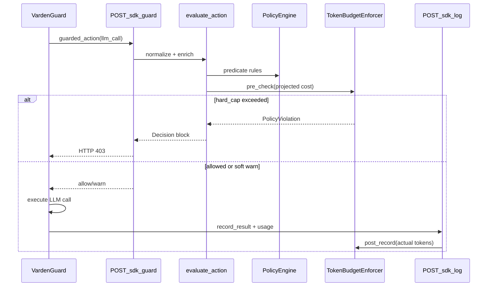

# Token Budget Rule Implementation Plan

## Overview

Introduce `TokenBudgetRule` with SQLite-backed spend tracking, server-side pre/post enforcement via `/sdk/guard` and `/sdk/log`, SDK usage forwarding (required), `BEGIN IMMEDIATE` atomic increments, and `varden budget status` CLI. No frontend/MCP/dashboard changes.

---

## What the codebase looks like today

After reading the relevant paths, a few spec terms do not exist yet and need to be mapped deliberately:

| Spec term | Current reality |
|-----------|-----------------|
| `PolicyViolation` | Not present. Blocks today flow through `Decision(action="block")` → `HTTPException(403)` in `varden/app_factory.py` and `VardenBlockedError` in `varden_sdk/sdk.py`. |
| Rule class hierarchy | Not present. Rules are JSON dict predicates evaluated by `PolicyEngine` in `varden/policy.py` via `_matches()`. |
| `~/.varden.db` | DB path is `AppConfig.db_path` in `varden/config.py` (default `varden.db`, overridable via `VARDEN_DB_PATH`). Migrations live in `varden/db.py` (`schema_migrations` + `_apply_migrations`). |
| Tool interception | Central path: `POST /sdk/guard` → `evaluate_action()` → `policy.evaluate()`; post-exec via `POST /sdk/log`. SDK wraps tools/LLMs with `guarded_action()` / `record_result()`. LLM hooks are in `_patch_openai` / `_patch_anthropic` in `varden_sdk/sdk.py`. |



---

## Architecture decisions

### Session keys for budgets

- **`window: "session"`** → budget row keyed by `(policy_id, trace_id)`
- **`window: "daily" | "monthly"`** → budget row keyed by `(policy_id, workflow_id)`
- **`reset_at`** is wall-clock UTC only (midnight UTC / first-of-month UTC), independent of workflow lifetime
- **`token_events`** always stores **both** `trace_id` and `workflow_id` for aggregation in either direction

### PolicyViolation

Add `PolicyViolation` in a new `varden/exceptions.py`. Raised only inside budget enforcement; caught in `evaluate_action()` and converted to a `Decision(action="block", reason=...)` so existing 403 / event persistence behavior stays unchanged. Tests will assert `PolicyViolation` at the enforcer unit level and 403 at the API integration level.

### Policy document shape

Introduce a new top-level policy section (does not fit predicate buckets):

```json
{
  "block": [],
  "warn": [],
  "monitor": [],
  "allow": [],
  "budget_rules": [
    {
      "id": "default-session-cap",
      "type": "token_budget",
      "limit_usd": 5.0,
      "window": "session",
      "hard_cap": true,
      "model_costs": {
        "claude-sonnet-4-6": { "input": 3.0, "output": 15.0 }
      }
    }
  ]
}
```

`PolicyEngine.validate()` will be extended to validate `budget_rules` separately (typed rules, not predicate dicts).

---

## Blockers (must ship in this PR before anything else works in production)

### 1. SDK must forward `response.usage` to `/sdk/log`

Without this, `post_record` is blind in production and all budget rows stay at zero.

**Required change in this PR** — not a follow-up:

- `varden_sdk/sdk.py`: update `_patch_openai` and `_patch_anthropic` so `record_result()` includes usage in `output_payload`
- Extract from response objects:
  - OpenAI: `response.usage` (`prompt_tokens`, `completion_tokens`, `model` if available)
  - Anthropic: `response.usage` (`input_tokens`, `output_tokens`)
- Normalize to a stable shape the server parser expects:

```json
{
  "provider": "openai",
  "model": "gpt-4o",
  "usage": { "input_tokens": 1200, "output_tokens": 400 }
}
```

- Mirror the same change in `sdks/python/varden_sdk/sdk.py` if kept in sync with the bundled copy

Add an integration test: guarded LLM call → `/sdk/log` payload contains usage → `token_events` row written and `current_usd` incremented.

### 2. Pre-check output projection must not default to zero

A zero output projection defeats the hard cap.

**Output token estimate for PRE check** (in order):

1. `max_tokens` / `max_output_tokens` from request kwargs if present
2. Else model's **published context/output limit** from a built-in lookup table keyed by model string (same models as default costs: `claude-sonnet-4-6`, `claude-opus-4-6`, `claude-haiku-4-5`, `gpt-4o`, plus aliases)
3. Never fall back to 0 for projection purposes

Add `DEFAULT_MODEL_LIMITS` (or `output_limit` field alongside costs) in `varden/rules/token_budget.py`. Unknown models use the most conservative (largest) limit from the table, consistent with the max-rate fallback.

### 3. Budget increment must be atomic (`BEGIN IMMEDIATE`)

Two separate reads/writes inside a regular transaction are not sufficient under concurrent guard/log calls.

**All budget mutations** (pre-check read + post-check increment) go through a single store method using SQLite `BEGIN IMMEDIATE`:

```python
conn.execute("BEGIN IMMEDIATE")
# read current_usd (with reset-if-needed)
# check limit (pre) or compute cost and increment (post)
# write token_events + update token_budgets.current_usd
conn.commit()
```

- Pre-check: load budget row, apply reset logic, compute projected cost, compare to limit — all inside the immediate transaction before returning allow/block
- Post-record: insert `token_events`, increment `current_usd` — same transaction, no separate read-then-write outside it
- On conflict/lock failure: retry once or surface error per existing fail-mode conventions

Concurrency safety is required in v1 — not deferred to a follow-up.

---

## 1. Schema migration (version 3)

Extend `varden/db.py` `_apply_migrations()` to add migration **3**:

### `token_events`

- `id INTEGER PRIMARY KEY`
- `trace_id TEXT NOT NULL`
- `workflow_id TEXT`
- `timestamp REAL NOT NULL`
- `model TEXT NOT NULL`
- `input_tokens INTEGER NOT NULL`
- `output_tokens INTEGER NOT NULL`
- `cost_usd REAL NOT NULL`
- `tool_name TEXT`
- Index on `(trace_id)`, `(workflow_id)`, `(timestamp)`

### `token_budgets`

- `id INTEGER PRIMARY KEY`
- `policy_id TEXT NOT NULL` (budget rule `id` from policy JSON)
- `trace_id TEXT` (populated for `session` window)
- `workflow_id TEXT` (populated for `daily`/`monthly`)
- `window TEXT NOT NULL` (`session` | `daily` | `monthly`)
- `limit_usd REAL NOT NULL`
- `current_usd REAL NOT NULL DEFAULT 0`
- `reset_at REAL` (NULL for session window)
- Unique constraint on `(policy_id, trace_id, workflow_id, window)` with only the relevant key column set

Add `varden/token_budget.py` with a `TokenBudgetStore` (mirroring `EventStore` in `varden/stores.py` patterns): load/upsert budget row, reset if `now > reset_at`, **`BEGIN IMMEDIATE` atomic read-check-update**, insert token event, list active budgets for CLI.

---

## 2. Rule type system

Create `varden/rules/` module:

- **`base.py`**: `BaseRule`, `PredicateRule` (wrapper for existing JSON predicate rules — keeps current matching logic intact)
- **`token_budget.py`**: `TokenBudgetRule` dataclass
  - Fields: `id`, `limit_usd`, `window`, `hard_cap`, `model_costs`
  - `DEFAULT_MODEL_COSTS` for: `claude-sonnet-4-6`, `claude-opus-4-6`, `claude-haiku-4-5`, `gpt-4o`
  - `DEFAULT_MODEL_OUTPUT_LIMITS` for the same models (used when `max_tokens` absent in PRE projection)
  - `from_dict()` / `validate()` / `merge_costs()` (user overrides merged over defaults)
- **`registry.py`**: parse `budget_rules` from policy JSON into typed rules

Extend `PolicyEngine` in `varden/policy.py`:

- Load and cache `budget_rules: list[TokenBudgetRule]`
- Keep existing predicate evaluation unchanged for `block/warn/monitor/allow`
- Add `get_budget_rules()` for enforcer/CLI

---

## 3. Cost calculation and token extraction

Add helpers in `varden/token_budget.py`:

**Cost formula** (per spec):

```
(input_tokens / 1_000_000 * input_rate) + (output_tokens / 1_000_000 * output_rate)
```

**Unknown model**: log warning via stdlib `logging`, fall back to max `(input + output)` rate across known models (conservative; never skip).

**PRE projection** (on `llm_call` at guard time, inside `BEGIN IMMEDIATE` transaction):

- Parse model from action args (`kwargs.model` / nested OpenAI-Anthropic shapes)
- Estimate `input_tokens` from request payload text (chars/4 heuristic — no new deps)
- Estimate `output_tokens`: `max_tokens` / `max_output_tokens` if present, else model's published output limit from `DEFAULT_MODEL_OUTPUT_LIMITS` (never 0)
- Compare `current_usd + projected > limit_usd`

**Boundary semantics**:

- Allow when `current_usd + projected <= limit_usd` (exactly-at-limit with zero projected cost proceeds)
- Block when `>` and `hard_cap=True`

**POST recording** (on `sdk_log` for `llm_call`):

- Extract actual usage from `output_payload.usage` forwarded by SDK (OpenAI/Anthropic normalized shape; explicit test payloads also accepted)
- Insert `token_events` row and increment `token_budgets.current_usd` in the same `BEGIN IMMEDIATE` transaction

**Reset logic**:

- `session`: `reset_at = NULL`, never auto-zero
- `daily`: `reset_at = next midnight UTC`; on load if `now >= reset_at`, zero `current_usd` and advance `reset_at`
- `monthly`: `reset_at = first day of next month UTC`; same reset-on-load behavior

---

## 4. Enforcement hooks (server-side only)

Modify `evaluate_action()` in `varden/app_factory.py`:

1. After `normalize_action` + `enrich_action`, before returning:
   - If `action.type == "llm_call"`, run `TokenBudgetEnforcer.pre_check(action, raw_payload, rules, store)`
   - `hard_cap` exceeded → catch `PolicyViolation` → return `Decision(action="block", reason="token budget exceeded", matched_rule={...})`
   - soft exceed → return `Decision(action="warn", reason="token budget exceeded (soft cap)", ...)` without raising

Modify `sdk_log` handler in same file:

2. If `action.type == "llm_call"` and call actually ran (not blocked at guard), run `TokenBudgetEnforcer.post_record(action, input_payload, output_payload, store)`

No changes to Sankey frontend, MCP server, or dashboard views.

---

## 5. CLI: `varden budget status`

Extend `varden/cli.py`:

```bash
varden budget status [--db-path PATH]
```

- Resolves DB from `VARDEN_DB_PATH` or project `varden.db`
- Loads active `token_budgets` rows
- Prints per row: session key (trace or workflow), window, current spend, limit, remaining, reset_at, hard_cap (from policy rule lookup)
- Human-readable table to stdout; exit 0

---

## 6. Tests

New file `tests/test_token_budget.py` using existing `TemporaryDirectory` + `TestClient` pattern from `tests/test_sdk.py`:

| Test | Approach |
|------|----------|
| Budget not exceeded | Guard llm_call with spend below limit → 200 |
| Exactly at limit | Set `current_usd == limit_usd`, projected cost 0 → 200 |
| Exceeded + hard_cap | Pre-check raises `PolicyViolation`; guard → 403 |
| Exceeded + soft cap | Decision `warn`, guard → 200; event status warned |
| Daily reset | Freeze time past midnight UTC; load budget → `current_usd == 0`, new `reset_at` |
| Unknown model fallback | Model not in costs → warning logged, max rate used |
| SDK usage forwarding | Mock LLM response with usage → log payload includes tokens → budget incremented |
| Output projection fallback | No `max_tokens` in request → uses model output limit, not zero |
| Atomic increment | Concurrent post_record calls do not lose updates (transaction test) |

Unit tests for `TokenBudgetRule`, cost math, reset helpers, and store CRUD will run without HTTP; integration tests hit `/sdk/guard` and `/sdk/log`.

---

## Files to create / modify

### Create

- `varden/exceptions.py`
- `varden/rules/base.py`
- `varden/rules/token_budget.py`
- `varden/rules/registry.py`
- `varden/token_budget.py` (store + enforcer)
- `tests/test_token_budget.py`

### Modify

- `varden/db.py` — migration 3 tables
- `varden/policy.py` — load/validate budget rules
- `varden/app_factory.py` — pre/post hooks
- `varden/cli.py` — `budget status` subcommand
- `varden_sdk/sdk.py` — forward `response.usage` in LLM patch `record_result` calls (blocker #1)
- `sdks/python/varden_sdk/sdk.py` — keep in sync if applicable

### Explicitly out of scope

- `frontend/`, `varden_mcp/`, dashboard API/views

---

## Implementation order

1. Schema migration
2. Rule types + defaults
3. TokenBudgetStore with `BEGIN IMMEDIATE`
4. SDK usage forwarding (blocker)
5. Enforcement hooks in app_factory
6. CLI `budget status`
7. Tests

---

## Checklist

- [ ] Add `token_events` + `token_budgets` tables in `varden/db.py` migration v3
- [ ] Create `varden/rules/` with `BaseRule`, `TokenBudgetRule`, registry, default model costs
- [ ] Implement `TokenBudgetStore` with `BEGIN IMMEDIATE` atomic increment + cost/reset/token extraction helpers
- [ ] Patch `_patch_openai` / `_patch_anthropic` to forward `response.usage` in `/sdk/log` output_payload
- [ ] Wire `pre_check` / `post_record` into `evaluate_action` and `sdk_log`; add `PolicyViolation`
- [ ] Add `varden budget status` subcommand to `varden/cli.py`
- [ ] Write `tests/test_token_budget.py` — six core scenarios plus SDK usage, output-limit projection, and atomic increment tests
