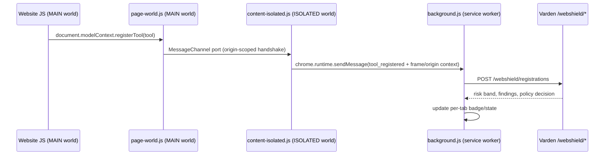

# Web Shield browser extension

`extension/` is a Chromium Manifest V3 extension that observes WebMCP tool
activity in the page and reports it to a local or configured Varden server.
It is a **development build**, distributed unpacked or as a reproducible
zip; it is not published to the Chrome Web Store by this project (see
"Packaging" in `docs/web-shield.md`).

## Install (development)

```bash
varden web-shield extension path   # prints the unpacked extension directory
```

1. Open `chrome://extensions`.
2. Enable "Developer mode" (top right).
3. Click "Load unpacked" and select the printed directory (`extension/`).
4. Click the Varden Web Shield toolbar icon → the popup's "Options" link →
   set the server endpoint (default `http://127.0.0.1:8000`) and choose
   Observe or Enforce.
5. Open the attack lab (`varden web-shield demo` prints its URL) and reload
   the page — the extension should immediately show a non-zero badge count
   once the page registers tools.

There is no fully-automatic install path; Chrome does not allow an unpacked
extension to install itself. This is the shortest safe workflow.

## Architecture: two content-script worlds

Chrome MV3 lets a content script run in the page's own JS context (`world:
"MAIN"`) or in an isolated context that shares the DOM but not JS globals
(`world: "ISOLATED"`, the historical default). Extensions need both:

- **`extension/src/page-world.js`** (`world: "MAIN"`, `run_at:
  "document_start"`, `all_frames: true`): runs in the page's own context,
  which is the only place `document.modelContext` and
  `navigator.modelContext` actually exist as live objects. It wraps
  `registerTool`, `unregisterTool`, `provideContext` and `clearContext` on
  both surfaces when present, and watches for the `modelContext` property
  itself being replaced after first install (`guardProperty`). It cannot call
  `chrome.runtime` APIs directly — page-world scripts have no extension
  privileges — so it talks to the isolated world over a `MessageChannel`
  whose port is handed over during a one-time handshake, scoped to the
  page's own origin (`window.postMessage(..., window.location.origin, ...)`),
  so another origin's script cannot inject itself into the channel.
- **`extension/src/content-isolated.js`** (`world: "ISOLATED"`, same
  matches/timing): completes the handshake, receives relayed events over the
  `MessageChannel`, and forwards them to the background service worker via
  `chrome.runtime.sendMessage`, attaching frame/origin context
  (`frameId`, `topOrigin`, `isThirdPartyFrame`, `scriptSourceOrigin`) that
  only the isolated world/extension APIs can determine.
- **`extension/src/background.js`** (MV3 service worker): the only place that
  ever makes a network request. Owns configuration (`chrome.storage.local`),
  session IDs (`chrome.storage.session`, one per tab), the connected/local
  fallback decision, the toolbar badge, and the capped offline queue.
- **`extension/src/fallback-rules.js`**: the compact deterministic scanner
  used when the server is unreachable (see "Local fallback" below).
- **`extension/src/popup.html/css/js`**: toolbar popup (current-site panel).
- **`extension/src/options.html/js`**: endpoint + Observe/Enforce configuration.



## What is, and is not, interceptable

Be precise about what "observes WebMCP activity" means:

- The extension can **wrap** `registerTool`/`unregisterTool`/`provideContext`/
  `clearContext` if they are called after `document_start`, which is the
  earliest a content script can run — before that point, nothing can
  observe or intercept anything, including a page's own inline `<script>`
  tags that run before any extension.
- It can **detect** (not prevent) a page later replacing `document.modelContext`
  itself with a fresh object, via a property guard (`webmcp.context_replaced`)
  — this is forensic, not preventive: by the time the event fires, the
  replacement has already happened.
- It **cannot** observe an agent's internal reasoning, an agent's decision to
  call a tool at all if the agent runs entirely in a native app or backend
  rather than the observed page, or any WebMCP-equivalent behaviour that
  happens through a mechanism the extension has no visibility into (e.g. a
  future non-DOM-based tool-exposure API).
- Achieved enforcement for **registration** and **invocation** events can be
  real (the extension can, in principle, decline to call through to the
  page's real `registerTool`) — but the current extension code observes and
  reports; it does not yet withhold registration from the page based on the
  server's decision the way the JS SDK's `mode: "enforce"` does (see
  `docs/web-shield-sdk.md`). Treat the extension today as **observe-mode
  telemetry with local-fallback detection**, and use the SDK when you need
  actual browser-side enforcement in your own integration. This gap is
  tracked in `docs/web-shield-limitations.md`.

## Local fallback

`extension/src/fallback-rules.js` runs entirely inside the extension with no
network access, so it works when the Varden server is offline. It applies a
small, fast, regex-based rule set covering:

- instruction-hierarchy override phrasing;
- cross-tool direction language;
- secrecy/anti-disclosure demands;
- credential-shaped field names;
- zero-width/invisible characters;
- oversized descriptions;
- a false `readOnlyHint` paired with a mutating verb in the description.

It computes a local score/band independently of the server's risk engine —
the two are related in spirit (they share the same threat categories) but
are **not the same code path**, so results can differ slightly between
connected and offline mode. This is a deliberate simplicity trade-off (see
`docs/web-shield-limitations.md`), not a claim of parity.

When disconnected, `background.js`:

- sets `state.connected = false` and shows a grey badge with title "local
  protection only (server unreachable)" rather than a colour that implies a
  server-backed decision;
- queues the redacted event body (never raw secrets — the same
  `redact_webmcp_value`-equivalent redaction applies before the body is even
  constructed) into `chrome.storage.local`, capped at `MAX_QUEUE_SIZE = 200`
  entries (oldest dropped first);
- retries via a `chrome.alarms` health check every 30 seconds
  (`varden-webshield-health`), flushing the queue once the server responds.

## Toolbar badge

| Colour | Text | Meaning |
|---|---|---|
| Grey | `?` | Server unreachable — local fallback protection only. |
| Green | tool count | Connected, highest observed risk band is `low`. |
| Amber | tool count | Connected, highest band is `guarded`/`suspicious`. |
| Red | tool count | Connected, highest band is `high`/`critical`. |

The title attribute (tooltip) always spells out the state in text (e.g.
"Varden Web Shield: local protection only (server unreachable)") so the
signal is never colour-only.

## Permissions and CSP

`extension/manifest.json` requests the minimum viable permission set:

- `storage`, `activeTab`, `scripting` — no broad host permissions for content
  script injection beyond what MV3's `content_scripts` manifest entry itself
  grants.
- `host_permissions` limited to `127.0.0.1`/`localhost` on http and https —
  the extension can only ever talk to a local Varden server, not an arbitrary
  remote origin, unless you deliberately configure one via Options.
- `content_security_policy.extension_pages`: `"script-src 'self';
  object-src 'none'"` — no remote or inline script execution in the popup/
  options pages.

See `docs/web-shield-security.md` for the full localhost threat model and
message-spoofing defences.

## Known gaps (be honest about test coverage)

There is no headless-browser integration harness for this extension in this
repository (no Playwright/Puppeteer suite). The extension code is exercised
manually and via the shared `fallback-rules.js` logic mirrored conceptually
in the Python-side test corpus, but not via automated multi-frame, spoofed-
message, or extension-reload browser tests as originally scoped. This is the
single biggest test-coverage gap relative to the Python core (174+ passing
tests) and is called out explicitly in `docs/web-shield-limitations.md` and
the final delivery report.
