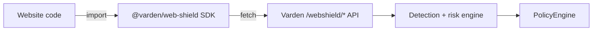

# `@varden/web-shield` JavaScript SDK

Package: `sdks/js/web-shield/`. Framework-neutral, TypeScript-typed, zero
runtime dependencies beyond the platform `fetch`. It talks to the same
`/webshield/*` API used by the browser extension and the attack lab — there
is exactly one detection/risk/policy engine (`varden/webshield`, Python), and
every integration path (extension, SDK, curl, the lab) is a thin client of
it. The SDK does not duplicate any scanning logic.

For the full API reference, TypeScript examples, the `install()` wrapper,
sanitisation handling, and an agent-integration example that scans tool
output, see `sdks/js/web-shield/README.md` — it is kept next to the code so
it can't drift from what's actually exported. This document covers the
parts that matter at the repository/architecture level: where the SDK fits,
what "enforce" mode actually does client-side, and how it differs from the
extension.

## Where this fits



The SDK is the **first-party integration path**: it runs as part of the
website's or agent-host's own code, so unlike the browser extension (which
can only wrap what the platform exposes to a content script), it can
genuinely refuse to call through to `modelContext.registerTool` at all when
the server says `block`. This is the concrete difference behind the
`achieved_enforcement` field on Web Shield events: SDK-mediated registrations
in `enforce` mode can honestly report `achieved_enforcement: "block"`;
extension-observed registrations today can only report the server's
decision without necessarily having been able to act on it (see
`docs/web-shield-extension.md`).

## `mode: "observe"` vs `mode: "enforce"`

Both modes send identical data to the server and get back an identical risk/
policy decision — detection and policy evaluation never differ by SDK mode.
The only thing that differs is what the SDK does locally with the result:

- `mode: "observe"` (safe for adoption/compatibility testing): `result.blocked`
  is always `false`, so an explicit `shield.registerTool(...)` call always
  proceeds to call through to `modelContext.registerTool` with the original
  (or sanitised) tool. The server's real decision is still returned on the
  result object for logging/telemetry.
- `mode: "enforce"` (the default): when an **explicit**
  `shield.registerTool(modelContext, tool)` call's decision is `block`,
  `result.blocked` is `true` and the SDK does not call
  `modelContext.registerTool` at all; when the decision is `sanitise` and the
  server returned a sanitised tool, that sanitised definition is passed to
  `modelContext.registerTool` instead of the original. `scanOutput` and
  `evaluateInvocation` compute the same `blocked` flag from the server's
  decision, but return the result to the caller either way — it is the
  caller's responsibility to act on `result.blocked` (see the "agent
  integration" example in `sdks/js/web-shield/README.md`, which throws when
  `blocked` is true rather than the SDK doing so implicitly).

**`install()` does not enforce.** The opt-in wrapper fires
`shield.registerTool(...)` in the background (for reporting/telemetry) but
*always* calls the page's original `registerTool` synchronously, regardless
of mode or decision — it cannot do otherwise, because it must return
synchronously from the wrapped call before the async server round-trip
completes. Use `install()` for zero-code-change visibility; use explicit
`shield.registerTool(modelContext, tool)` calls when you need `enforce` mode
to actually withhold a registration.

## Build and test

```bash
cd sdks/js/web-shield
npm install
npm run build   # tsc -p tsconfig.json -> dist/
npm test        # node --test "test/**/*.test.js" (stubbed fetch, no network/browser needed)
```

`package.json`'s `pretest` script runs the build first, so `npm test` alone
is sufficient. There is no bundler step and no framework dependency — the
compiled `dist/index.js` is a plain ES module importable via a `<script
type="module">` tag, a bundler, or Node.

## Versioning and events

Every event the SDK sends carries `extension_version`/`sdk_version` fields so
server-side records always know which client produced them (relevant when
correlating behaviour across the extension and multiple SDK integrations on
the same session). The SDK's own version constant tracks `package.json`.

## Known limitations

- The SDK cannot intercept a tool registration that happens through code the
  website author didn't route through it — if a page calls
  `document.modelContext.registerTool` directly without either calling
  `shield.registerTool(...)` or having called `shield.install()` first,
  Web Shield sees nothing. `install()` closes this gap for same-page code,
  but not for tools registered from a different frame/origin that hasn't
  also loaded the SDK (that scenario is what the browser extension is for).
- No React/Vue/Svelte-specific wrapper is provided; none is needed, since the
  API is plain functions/promises usable from any framework's effect/lifecycle
  hook.
- The SDK does not implement a local fallback scanner (unlike the extension's
  `fallback-rules.js`) — if the configured Varden server is unreachable,
  `registerTool`/`scanOutput` calls fail and the caller must decide how to
  degrade (the `connection-change` event and `health()` exist for exactly
  this). This is a deliberate scope decision: the SDK targets a first-party
  integration that already assumes a reachable server, whereas the extension
  targets an untrusted third-party page where "offline-safe by default" is
  the whole point.
