# Varden Web Shield

**Runtime governance and tool-surface security for browser agents.**

Websites can now dynamically expose tools to browser-based AI agents via
[WebMCP](https://github.com/webmachinelearning/webmcp) (`document.modelContext.registerTool()` and
related APIs). That tool metadata — and everything a tool returns — is untrusted input, exactly
like an HTTP response body or a subprocess's stdout. Varden Web Shield extends Varden's existing
interception/policy/dashboard model to this new surface: it normalises what a page registers,
scans it with seven deterministic classifier layers, computes an explainable risk score, evaluates
it against your existing Varden policy, and records complete evidence — the same `allow` /
`monitor` / `warn` / `block` vocabulary Varden already uses, plus two new outcomes,
`require_approval` and `sanitise`, that are specific to a live, in-page integration.

This is **scanning + policy governance**, not a sandbox. It reduces and evidences risk from a new
attack surface; it does not guarantee an LLM cannot be manipulated, and it cannot intercept
browser-internal behaviour no extension can observe. See
[`docs/web-shield-limitations.md`](web-shield-limitations.md) before treating any claim here as an
absolute guarantee.

## Try it in two commands

```bash
pip install varden
varden web-shield demo
```

This starts Varden, merges the safe default `webmcp-web-shield` policy pack into your local
`policy.json` (additively — it never changes non-WebMCP behaviour), seeds a few example
registrations, and opens the **attack lab** — a local page that registers 20 safe, simulated
WebMCP tools (benign and malicious) so you can watch detection happen. Open
`http://127.0.0.1:8000/ui/web-shield` to see the dashboard.

## The four components

| Component | Where | What it does |
|---|---|---|
| Core engine | `varden/webshield/` | Normalises tool definitions, runs the 7-layer classifier, scores risk, evaluates policy, persists evidence. This is the only component with fuzz tests and a measured evaluation corpus. |
| Browser extension | `extension/` (MV3) | Wraps `document.modelContext`/`navigator.modelContext` as early as `document_start`, reports to the Varden API, falls back to a small local scanner when the server is unreachable. Functional; not covered by automated browser tests. |
| JS SDK | `sdks/js/web-shield/` (`@varden/web-shield`) | Framework-neutral client for a site or agent host to call Varden directly — the "first-party" integration path, which can genuinely withhold a call the extension cannot. Node-tested against a stubbed `fetch`. |
| Dashboard | `frontend/src/components/dashboard/WebShieldPage.tsx` | Overview metrics, tool inventory, tool detail (findings, risk drivers, lifecycle timeline), approvals, sessions — a new page in the existing Varden React app. |

## Architecture diagram

```mermaid
flowchart LR
    subgraph Browser
        Page[Website JS<br/>document.modelContext.registerTool] -->|wrapped by| PageWorld[Extension: page-world script]
        PageWorld -->|MessageChannel port| Isolated[Extension: isolated content script]
        SDK[Website using @varden/web-shield SDK] -->|fetch| API
        Isolated -->|chrome.runtime.sendMessage| BG[Extension: background service worker]
        BG -->|fetch, or local fallback if unreachable| API
    end
    subgraph Varden Server
        API[/webshield/* API/] --> Engine[7-layer classifier + risk engine]
        Engine --> Policy[PolicyEngine: allow/warn/block/require_approval/sanitise]
        Policy --> Store[(SQLite: webshield_tools/sessions/trust/approvals + events)]
        Store --> Dashboard[Web Shield dashboard]
    end
```



## Where to go next

- [`docs/web-shield-threat-model.md`](web-shield-threat-model.md) — the seven threat categories and how each is detected.
- [`docs/web-shield-policy.md`](web-shield-policy.md) — policy predicates and the default pack.
- [`docs/web-shield-extension.md`](web-shield-extension.md) — extension behaviour, permissions, and honest limitations.
- [`docs/web-shield-sdk.md`](web-shield-sdk.md) — SDK usage guide (also see `sdks/js/web-shield/README.md`).
- [`docs/web-shield-evaluation.md`](web-shield-evaluation.md) — corpus, `varden web-shield evaluate`, and the actual measured results.
- [`docs/web-shield-security.md`](web-shield-security.md) / [`docs/web-shield-privacy.md`](web-shield-privacy.md) — security and privacy posture.
- [`docs/web-shield-limitations.md`](web-shield-limitations.md) — what this cannot do. Read this one.
- [`docs/web-shield-architecture.md`](web-shield-architecture.md) — implementation note: what's reused, what's new, and phase-by-phase status.

## CLI reference

```bash
varden web-shield scan tool.json [--human]      # static scan, no server required
varden web-shield explain tool.json             # human-readable findings + risk drivers + remediation
varden web-shield evaluate [--json]             # run the labelled corpus, report precision/recall/F1/latency
varden web-shield demo [--port 8000] [--no-browser]
varden web-shield extension path                # print the unpacked dev extension directory
varden web-shield extension build [--out FILE]  # reproducible extension zip
varden web-shield trust list|add|remove <origin>
```
